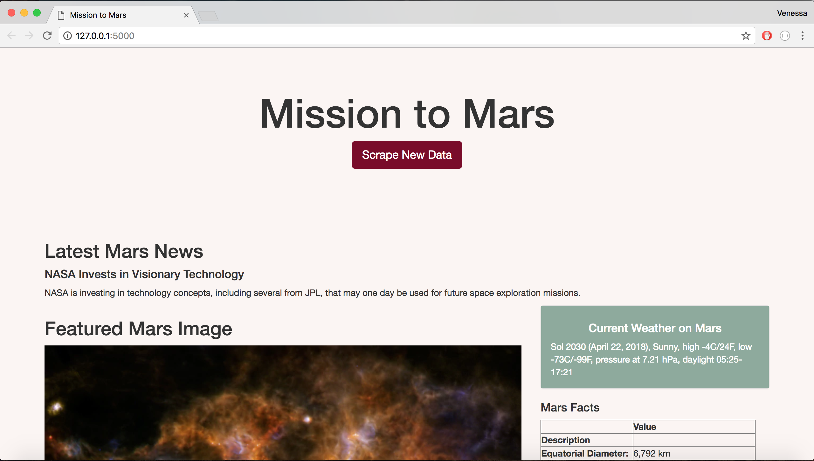

## Mission to Mars: Web-Scraping Project

## Scraping
- This project uses MongoDB(Flask_pymongo), Flask, pandas, requests, BeautifulSoup, splinter, and selenium webdriver to scrape data on Mars.
- Build a web application that scrapes various websites for data related to Mars and display the information in a single html page.
- Scrape NASA Mars News site to collect the latest news title and description about Mars.
- Scrape JPL's Featured Space Image for featured Mars image url.
- Scrape the Mars Weather twitter account for latest Mars weather tweet.
- Scrape a Mars Facts webpage using Pandas to extract table of Mars facts.
- Scrape USGS Astrogeology site to obtain high resolution images for each of Mars' hemispheres.

## MongoDB and Flask Application
- Create a scrape function in a Python script that scrapes all the websites and returns the information in a Python dictionary. 
- Create an app with Flask that executes the scrape function and store the return value in Mongo DB.
- Create a root route (/) that queries the Mongo database and renders the Mars data into an HTML template to display the data.

## Run without Heroku:
- Download the files in this repository and store in same folder.
- Start a MongoDB daemon in the terminal, then start mongo instance.
- Run the app.py in the terminal. Copy the local url to your web browser, or press COMMAND + doubleclick the local url.

